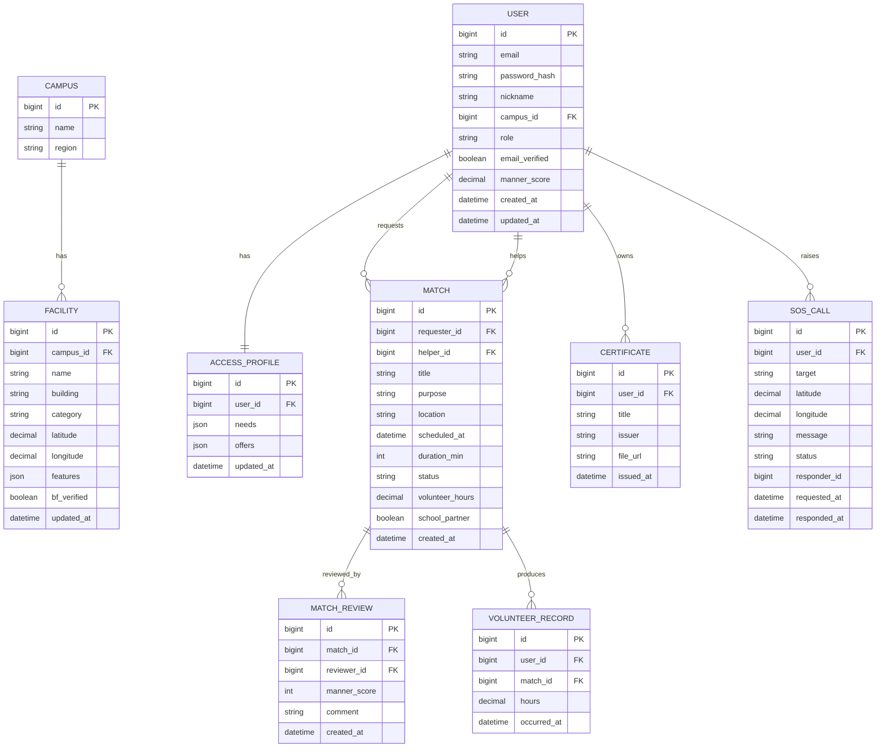

# 베프(BEFF) 사용자 앱 백엔드 설계 초안

현재 사용자 앱은 Mock 데이터 기반입니다. 이 문서는 사용자 앱의 화면·데이터 흐름을 기준으로 Spring Boot 백엔드 API를 붙이기 위한 1차 설계 초안입니다.

## 1. 설계 요약

베프 사용자 앱의 백엔드는 장애학생과 비장애학생이 캠퍼스 무장애 지도·친구 매칭·긴급 안전망·커뮤니티를 안전하게 이용할 수 있도록 사용자/매칭/시설/SOS/봉사시간 데이터를 관리하는 API 서버입니다.

1차 MVP는 사용자 앱 4개 탭(홈/지도/매칭/프로필) + SOS 다이얼로그가 동작하는 데 필요한 최소 도메인부터 구현합니다.

### 1차 MVP 핵심 범위

| 우선순위 | 범위 | 이유 |
|---|---|---|
| 1 | 사용자 인증/인가 | 학교 이메일 인증은 매칭 신뢰의 전제 |
| 2 | 사용자/접근 프로파일 | 매칭 알고리즘의 핵심 입력 |
| 3 | 매칭 CRUD + 상태 머신 | 서비스 핵심 흐름 |
| 4 | 봉사시간 기록 + 활동확인서 | 비장애학생 동기 |
| 5 | SOS 호출 | 안전망 가치 |
| 6 | 시설(무장애 지도) | 공공데이터 시드 + 사용자 신고 |
| 7 | 알림/푸시 | 자동 리마인더 |

커뮤니티, 외부 콘텐츠(공연/대외활동) 통합, 친구 관계 지속(스토리)은 2차 이후로 둡니다.

## 2. 도메인 목록

| 도메인 | 설명 | 프론트 화면 |
|---|---|---|
| User | 사용자 계정 | 전체 공통 |
| AccessProfile | 접근 프로파일(필요한 도움/제공 도움) | `ProfilePage` |
| Friendship | 친구 관계 | `ProfilePage` |
| Campus | 학교 | 공통 |
| Facility | 시설(무장애 지도) | `MapPage` |
| FacilityReport | 시설 사용자 신고 | `MapPage`(향후) |
| Match | 동행 매칭 | `MatchingPage` |
| MatchApplication | 매칭 신청 | `MatchingPage` |
| MatchReview | 매너 평가/회고 | `MatchingPage`(향후) |
| VolunteerRecord | 봉사시간 기록 | `ProfilePage` |
| Certificate | 활동확인서 | `ProfilePage` |
| SosCall | SOS 호출 | `SosDialog` |
| SosTarget | 호출 대상(보호자 등) | `SosDialog` |
| Post / Comment | 커뮤니티 게시글 | `HomePage` 인기글 |
| Notification | 알림 | 공통 |
| AuditLog | 감사 로그 | 공통(내부) |

## 3. ERD 초안



## 4. 매칭 상태 머신

```text
DRAFT → APPLIED → MATCHED → SCHEDULED → IN_PROGRESS → COMPLETED → REVIEWED
                                              ↓
                                          CANCELLED
```

- `COMPLETED` 시 `VolunteerRecord` 자동 생성
- `REVIEWED` 시 양측 `manner_score` 갱신
- `CANCELLED`는 어떤 단계에서든 가능, 사유 필드 필수

## 5. 보안·개인정보

- 매칭 상대에게는 본명 대신 마스킹 닉네임(예: 김\*\*)과 인증 배지만 노출
- 접근 프로파일 중 민감 필드(장애 유형 등)는 매칭 알고리즘 내부에서만 사용, 카드에는 노출 안 함
- SOS 호출은 위치·신원 즉시 전송, 호출자 동의는 사전 약관으로 일괄 처리
- 모든 변경성 작업은 `audit_logs`에 사용자 ID, IP, 액션, 대상 ID, 시각 저장

## 6. 외부 연동

| 외부 | 용도 | 백엔드 위치 |
|---|---|---|
| 학교 이메일(SMTP) | 인증 코드 발송 | Auth 서비스 |
| SMS / 알림톡 | SOS, 매칭 알림 | Notification 서비스 |
| FCM | 모바일 푸시 | Notification 서비스 |
| Tmap API | 보행자 경로 | Map 서비스(프록시 캐시) |
| 공공데이터(편의시설/BF) | 시설 시드 | 배치 동기화 |
| LLM | 매칭 추천 보조, 활동 회고 요약 | 별도 추론 서비스 |

## 7. API 명세 출발점

`docs/api-plan.md`의 화면별 API 후보를 기준으로 도메인 단위 컨트롤러 구성:

- `AuthController`
- `UserController` (`/api/users/me/*` 포함)
- `MatchController`
- `FacilityController`
- `SosController`
- `CertificateController`
- `NotificationController`

응답은 공통 `ApiResponse<T>` 래퍼(`status`, `data`, `error`)로 통일.
